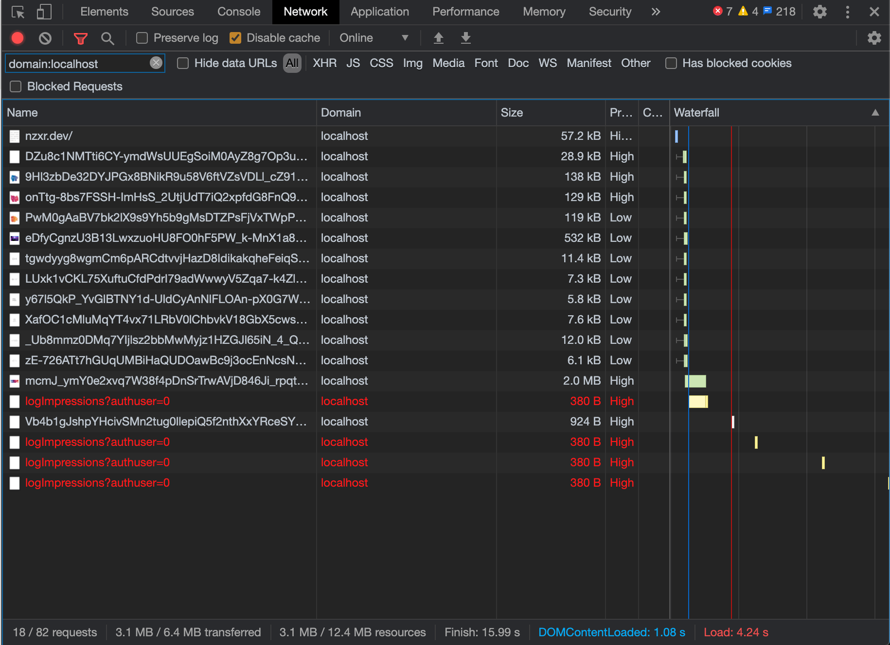

# nzxr.dev, remade

An attempt at improving an existing website.

## Baseline

[WebPageTest results](https://webpagetest.org/result/200824_RP_5fa7c59f553d42a941d9f4678dd1cbba/)

[Lighthouse results](./analysis/lighthouse-www.nzxr.dev-20200824T111452.html)

[HAR of the live site](./original/2020-08-24/nzxr.dev.har)

## Storing the baseline

Using `wget` I extracted a copy of the site, as it was running on 2020-08-24. The command I used was as follows:

```
wget
    --recursive
    --page-requisites
    --adjust-extension
    --span-hosts
    --convert-links
    --restrict-file-names=windows
    --domains nzxr.dev,googleusercontent.com
    https://nzxr.dev
```

This extract doesn't include the webfonts and extraneous CSS served from `fonts.google.com`, as this is user-agent specfic.

I ran a local python webserver, to get an idea of the footprint of assets required to run off one host.
I also disabled JavaScript to get a sense of the site's reliability.

Filtering by `domain: localhost`, I got the following result:



That's quite a lot for a one-pager, without JavaScript.

To make sure I didn't make any mistakes in the extract, here are two screenshots of the live site vs. my extract:

<details>
<summary>Screenshots</summary>

Live site


Extract


</details>

## Baseline analysis

### Images

There are some massive uncompressed images at play here. These will be the first target for reducing the overall weight of the site.

e.g. [A 2MB masthead image](https://lh6.googleusercontent.com/SD5lZDA7PwWFqJiZQj1DjmWvPzHi9C8tKq9FbbkbOeKcsiFhRya5lZWWcnjRBo07lGLgjdU=w16383)

### Cruft in the HTML

The HTML is a mess of JavaScript and Google proprietary code. A sitebuilder is at play here, could it be Google Sites?

### Self-hosting assets

5 domains to serve HTML, inline CSS, and images. That excludes the additional domains required for Google Fonts.
Using a warm and open connection for these supporting assets would see the response times drop significantly.

### Lastly, JavaScript, ugh.

The amount of third-party requests is insane. The Youtube video embeds are the major first offender, but the amount of analytics and ad data too is creepy.

If I have enough time, I'll see what can be done to drain the swamp.